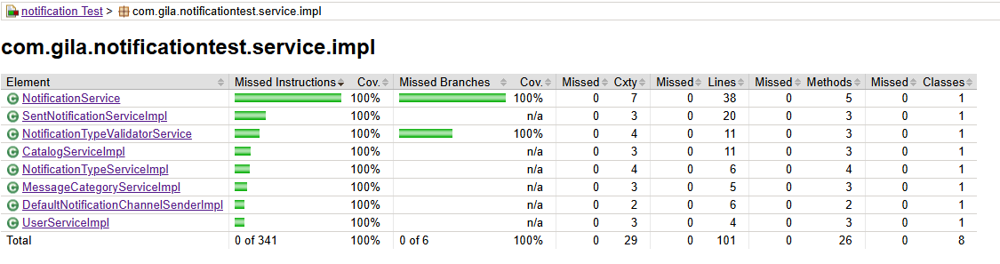

# Notification Management System

Spring Boot application designed to manage the delivery of notifications to users based on different categories and notification types.  
The system applies design patterns such as **Factory** and **Strategy**, and includes **unit tests with JaCoCo coverage enforcement** to ensure code quality.

---

## Email Notifications

The application sends email notifications using **Amazon Simple Notification Service (AWS SNS)**.

AWS SNS is responsible for publishing messages to the configured topics and delivering them to email subscribers in a reliable and scalable way.

---

## 🛠️ Technology Stack & Build Configuration

This project is built using **Spring Boot 3.3.5** and **Java 21**, following modern backend development practices.

### 🔹 Core Technologies

- **Java 21**  
  The application runs on Java 21, taking advantage of the latest language and JVM improvements.

- **Spring Boot 3.3.5**  
  Provides auto-configuration, dependency management, and production-ready features.

---

## 📦 Dependencies Overview

### Web & API
- **spring-boot-starter-web**  
  Used to build RESTful APIs and handle HTTP requests.

### Persistence
- **spring-boot-starter-data-jpa**  
  Provides JPA and Hibernate integration for database access.
- **MySQL Connector/J**  
  Runtime dependency for MySQL database connectivity.

### Validation
- **jakarta.validation-api**  
  Used for request and domain validation using annotations such as `@NotNull`, `@NotBlank`, and `@Size`.

### Database Migration
- **Flyway (core + mysql)**  
  Manages database schema migrations and versioning in a controlled and repeatable way.

### Developer Productivity
- **Lombok**  
  Reduces boilerplate code by generating getters, setters, constructors, and builders at compile time.

### Testing
- **spring-boot-starter-test**  
  Includes JUnit 5, Mockito, and Spring testing utilities for unit and integration testing.

---
## Error Handling

This API uses a centralized **Global Exception Handling** strategy to provide consistent and meaningful error responses.

Handled error types include:

- **Validation Errors (400)**  
  Triggered by invalid request payloads using Jakarta Bean Validation (`@NotNull`, `@NotBlank`, etc.).

- **Business Errors (400 / 409)**  
  Domain-specific rules enforced via custom `BusinessException` (e.g. no recipients, invalid channel).

- **Technical Errors (500)**  
  Unexpected infrastructure or service failures handled as internal server errors.

All exceptions are managed through a `@RestControllerAdvice`, keeping controllers clean and ensuring a consistent API error contract.

---

## 🧪 Test Coverage & Quality Control

This project uses **JaCoCo** to measure and enforce unit test coverage.

### JaCoCo Configuration Highlights

- Code coverage is focused on:

- The following layers are excluded from coverage metrics:
- Controllers
- Repositories
- Entities
- DTOs

This approach ensures that **business logic is properly tested**, without penalizing boilerplate or framework-driven code.

### Coverage Rules

- **Minimum method coverage:** `80%`
- The build **fails automatically** if coverage requirements are not met.

## 📊 Test Coverage Report



---

## 🏗️ Build & Execution

### Common Maven Commands

```bash
# Run tests with coverage
mvn clean test

# Run full verification (includes JaCoCo check)
mvn clean verify

# Run the application
mvn spring-boot:run
